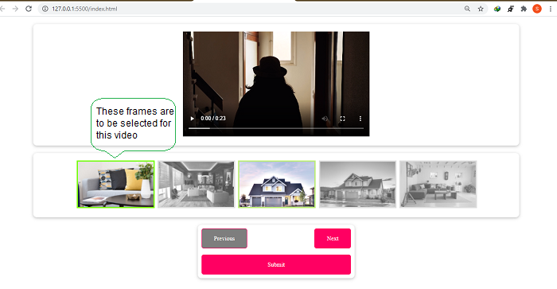
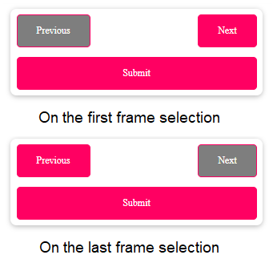

<h1>Javascript Functioning Project</h1>
<h3>About this Project</h3>

In this Project I have made frame selector with 5 diff options to select and going to select frames for another part of video and so on till we have 5 frames selected for 5 diff video parts(total combinations of 5^5).In which at the last I am posting a request to API of the path which the user takes whlie selecting frames.

Here you can see the frame which is selected is not featured grayscale in CSS and on which we hover our mouse is with featured grayscale(.5) with 0.9 opacity.

<h3>Applied media query</h3>
<ul style="text-align:center">
    <li></li>
    <li></li>
    <li></li>
</ul>
<h3>Disabled buttons on the start and end.</h3>

By default all the frames are selected for user as frame1 so Submit button is active throut the process.
